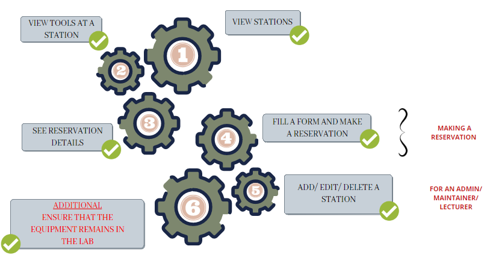
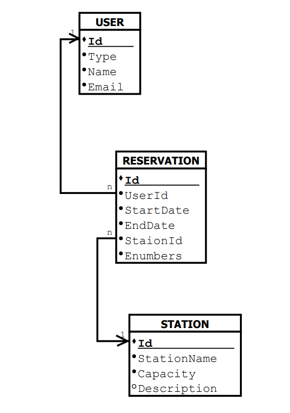

[comment]: # "This is the standard layout for the project, but you can clean this and use your own template"

# Smart Inventory Management System

---

## Team
-  E/18/147, JAMEEL S.  [e18147@eng.pdn.ac.lk](mailto:name@email.com)
-  E/18/242, NIMNADI J.A.S.  [e18242@eng.pdn.ac.lk](mailto:name@email.com)
-  E/18/379, WANDURAGALA T.D.B.  [e18379@eng.pdn.ac.lk](mailto:name@email.com)

## Table of Contents
1. [Introduction](#introduction)
2. [Solution Architecture](#solution-architecture)
3. [Data Flow](#data-flow)
4. [ER Diagram](#er-diagram)
5. [Relational Schema](#relational-schema)
6. [Other](#other)
7. [Links](#links)

## Introduction
---

#### About

Scheduling and maintaining assets are important in an engineering laboratory, or for that matter in any laboratory. Keeping track of the usage of all the tools manually is not easy, nor efficient. Hence, we now see that there are many automated systems used in labs to assist it with its activities. 

#### Problem

The most commonly used methods for inventory management such as file systems are hard to maintain and are often not updated frequently. In a lab therefore, you tend to lose track of the items available, and as a result not maintain them properly. 
Traditional laboratories also do not have facilities to make reservations in the lab. There are times when students come to the lab with the hope of using a particular machine or tool and find that it is being used by another person. This could happen to you everytime you go to the lab intending to use that instrument. You never find it vacant.
Having no proper scheduling system leads to the waste of time and resources.

#### Solution

Our project introduces a smart inventory management system with resource scheduling. This system maintains an inventory of all tools in the lab and allows students/ lecturers to view and make reservations online for a particular item.

## Solution Architecture
---

The Web Applciation is hosted using a remote server. The web system can be accessed by all user groups. Upon logging in, the users can access relevant pages according to the defined control flow. Accordingly, Guests, regular users(students), admins/ maintainers will be directed to their relevant pages in the site.
The users will thereafter be able to use the system to make/ view reservations for a particular station in the laboratory. 

## Data Flow
---

- Data can be entered by any user logged into the system.
- The data inserted will be sent to the servers as raw input.
- The data will be stored permenantly in the server and will be retrieved when needed to perform calculations.
- Data will be sent from the servers to the system for displaying purposes.
- For sending emails and for email verification, the SMTP serevr will be used.
- No data requests/ responses will be sent from the SMTP server to the web system.
- No data will be stored permenantly in the SMTP server.

## ER Diagram
---

## Relational Schema
---

## Other
---

##### The layout of the MakerSpace lab

##### A station in the lab

 

## Links

- [Project Repository](https://github.com/cepdnaclk/{{ page.repository-name }}){:target="_blank"}
- [Project Page](https://cepdnaclk.github.io/{{ page.repository-name}}){:target="_blank"}
- [Department of Computer Engineering](http://www.ce.pdn.ac.lk/)
- [University of Peradeniya](https://eng.pdn.ac.lk/)

[//]: # (Please refer this to learn more about Markdown syntax)
[//]: # (https://github.com/adam-p/markdown-here/wiki/Markdown-Cheatsheet)
